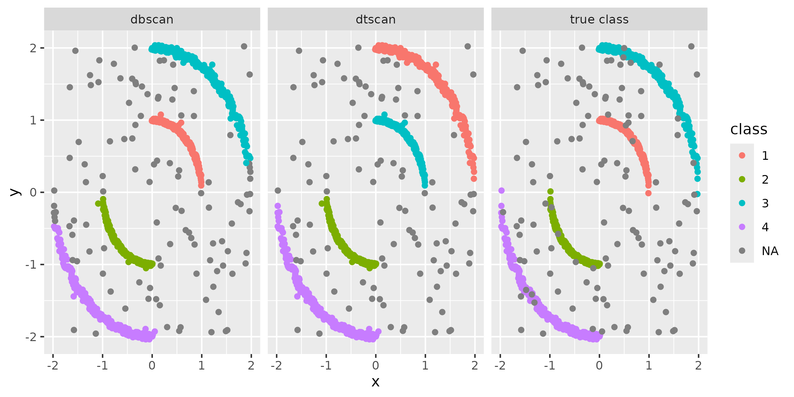

# dtscan


Triangle‑Based Density Clustering of 2D Points via Delaunay Graphs

dtscan provides density‑based clustering for 2D point sets by leveraging
a Delaunay triangulation graph. This package offers R bindings to the
Rust implementation originally developed in [Xenobalanus
(randogoth/xenobalanus)](https://github.com/randogoth/xenobalanus),
based on the algorithm of [Kim & Cho (2019) Delaunay triangulation-based
spatial clustering technique for enhanced adjacent boundary detection
and segmentation of LiDAR 3D point
clouds.](https://pmc.ncbi.nlm.nih.gov/articles/PMC6767241/)

------------------------------------------------------------------------

## Installation

- **R** (≥ 4.4.0)

``` r
remotes::install_github("valcu/dtscan")
```

------------------------------------------------------------------------


